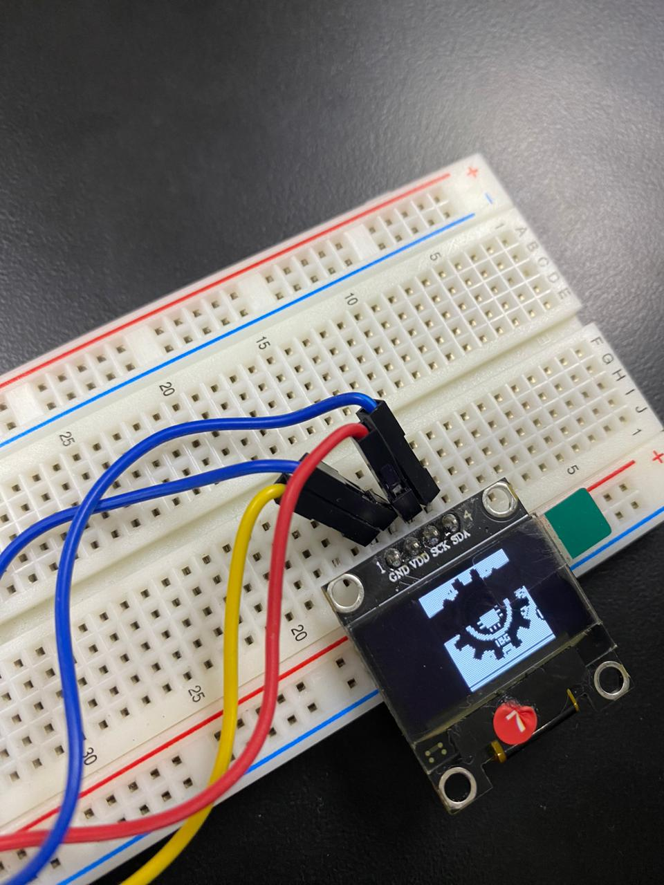
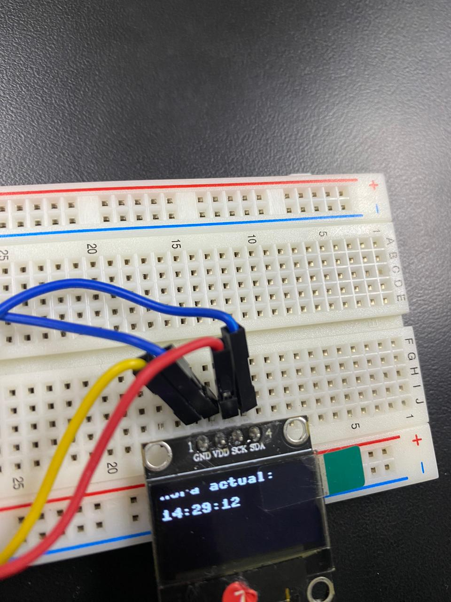

## Practica_2.1
# 2.1.1 Practica De inicio es la básico de Desplegar algo en pantalla, algunos quieren el logo de ISC, esta bien, otro texto simple, se agradece,  en el OLED DIsplay

"La práctica 2.1.1, llamada 'Práctica de Inicio en el OLED Display', se trata de aprender los conceptos fundamentales para mostrar contenido en una pantalla OLED. En esta práctica, estoy aprendiendo a mostrar elementos simples en la pantalla, como el logo de ISC (posiblemente una entidad o institución), o cualquier otro texto básico que desee incluir. Mi objetivo principal es familiarizarme con el funcionamiento y las capacidades de un OLED Display, lo cual es esencial para desarrollar proyectos más avanzados que involucren la visualización de información en pantallas. Esta práctica marca el inicio de mi exploración de las posibilidades que ofrece esta tecnología en el contexto de la informática y la electrónica."

Código que utilice en la práctica: 

"""
MARTINEZ GARCIA GABRIEL STOYKO - 20211808
"""

	from machine import Pin, I2C
	from ssd1306 import SSD1306_I2C
	import framebuf, sys
	import utime

	pix_res_x = 128
	pix_res_y = 64

	def init_i2c(scl_pin, sda_pin):
    # Initialize I2C device
    i2c_dev = I2C(1, scl=Pin(scl_pin), sda=Pin(sda_pin), freq=400000)
    i2c_addr = [hex(ii) for ii in i2c_dev.scan()]
    
    if not i2c_addr:
        print('No I2C Display Found')
        sys.exit()
    else:
        print("I2C Address      : {}".format(i2c_addr[0]))
        print("I2C Configuration: {}".format(i2c_dev))
    
    return i2c_dev

	def display_logo(oled):
    # Display the Raspberry Pi logo on the OLED
    plain_bytes = [
        0xff, 0xff, 0xff, 0xff, 0xff, 0xff, 0xff, 0xff, 0xff, 0xff, 0xff, 0xc7, 0xfc, 0x7f, 0xff, 0xff, 
	0xff, 0xff, 0xfe, 0x07, 0xf8, 0x1f, 0xff, 0xff, 0xff, 0xff, 0xfe, 0x07, 0xf8, 0x1f, 0xff, 0xff, 
	0xff, 0xff, 0xfe, 0x03, 0xf8, 0x1f, 0xff, 0xff, 0xff, 0xff, 0xf6, 0x03, 0xf0, 0x1f, 0xff, 0xff, 
	0xff, 0xff, 0xd6, 0x03, 0xf0, 0x1e, 0xff, 0xff, 0xff, 0xff, 0xff, 0x00, 0x00, 0x3f, 0xe7, 0xff, 
	0xff, 0xf8, 0xff, 0x00, 0x00, 0x1f, 0xc3, 0xff, 0xff, 0xf0, 0x7c, 0x00, 0x00, 0x07, 0x81, 0xff, 
	0xff, 0xe0, 0x30, 0x00, 0x02, 0x02, 0x00, 0xff, 0xff, 0xe0, 0x00, 0x00, 0x02, 0x00, 0x01, 0xff, 
	0xff, 0xf0, 0x00, 0x80, 0x00, 0x00, 0x03, 0xff, 0xff, 0xf0, 0x00, 0x00, 0x40, 0x00, 0x07, 0xff, 
	0xff, 0xf8, 0x00, 0x0f, 0xfe, 0x00, 0x0f, 0xff, 0xff, 0xfc, 0x00, 0x7e, 0x0f, 0xc0, 0x0b, 0x7f, 
	0xff, 0xfc, 0x00, 0xf0, 0x01, 0xe0, 0x07, 0xff, 0xff, 0xfc, 0x01, 0xc0, 0x00, 0x70, 0x05, 0xff, 
	0xff, 0xf8, 0x03, 0x82, 0x48, 0x38, 0x03, 0x7f, 0xff, 0xf8, 0x07, 0x02, 0x48, 0x1c, 0x01, 0x87, 
	0xf8, 0x10, 0x0e, 0x00, 0x00, 0x0e, 0x00, 0x07, 0xf8, 0x00, 0x1c, 0x07, 0xfc, 0x07, 0x00, 0x03, 
	0xf8, 0x00, 0x1c, 0x0f, 0xfe, 0x03, 0x00, 0x03, 0xf8, 0x00, 0x38, 0x7f, 0xff, 0xc3, 0x80, 0x03, 
	0xf8, 0x00, 0x38, 0x0f, 0xfe, 0x03, 0x80, 0x03, 0xfc, 0x00, 0x30, 0x0f, 0xfe, 0x01, 0x80, 0x3f, 
	0xff, 0x80, 0x70, 0x2f, 0xfe, 0xc1, 0x80, 0xf7, 0xff, 0xc0, 0x70, 0x0f, 0xfe, 0x01, 0xc0, 0xf9, 
	0xff, 0xc0, 0x70, 0x2f, 0xfe, 0xc1, 0xc0, 0x7f, 0xff, 0xc2, 0x70, 0x0f, 0xfe, 0x01, 0xc0, 0xe7, 
	0xff, 0x40, 0x70, 0x0f, 0xfe, 0x01, 0xc0, 0x7b, 0xff, 0xe0, 0x70, 0x7f, 0xff, 0xc1, 0x80, 0x4f, 
	0xff, 0xc0, 0x38, 0x0f, 0xfe, 0x01, 0x80, 0x1f, 0xfe, 0x00, 0x38, 0x0f, 0xfe, 0x03, 0x80, 0x03, 
	0xf8, 0x00, 0x38, 0x7f, 0xfe, 0xc3, 0x80, 0x03, 0xf8, 0x00, 0x1c, 0x07, 0xfe, 0x07, 0x00, 0x03, 
	0xf8, 0x00, 0x1c, 0x07, 0xfc, 0x07, 0x00, 0x03, 0xf8, 0x00, 0x0e, 0x00, 0x00, 0x0e, 0x00, 0x07, 
	0xfc, 0x00, 0x0f, 0x02, 0x48, 0x1c, 0x03, 0xc7, 0xfc, 0xf8, 0x07, 0x82, 0x48, 0x3c, 0x00, 0xff, 
	0xff, 0xf8, 0x03, 0xe0, 0x00, 0xf8, 0x04, 0xdf, 0xff, 0xfc, 0x01, 0xf8, 0x01, 0xe0, 0x07, 0xbf, 
	0xff, 0xfc, 0x00, 0x7f, 0xff, 0xc0, 0x03, 0x7e, 0xff, 0xfe, 0x00, 0x1f, 0xff, 0x00, 0x06, 0xfc, 
	0xff, 0xfc, 0x00, 0x03, 0xf8, 0x00, 0x03, 0xfd, 0xff, 0xf8, 0x00, 0x00, 0x00, 0x00, 0x01, 0xf9, 
	0xff, 0xf0, 0x00, 0x05, 0xdc, 0x00, 0x00, 0xf9, 0xff, 0xe0, 0x00, 0x05, 0xd0, 0x01, 0x00, 0xf9, 
	0xff, 0xf0, 0x18, 0x05, 0x74, 0x07, 0x81, 0xf9, 0xff, 0xf8, 0x7e, 0x05, 0xdc, 0x0f, 0xc3, 0xfd, 
	0xff, 0xfc, 0xff, 0x80, 0x00, 0x1f, 0xe7, 0xfc, 0xff, 0xff, 0xff, 0x00, 0x00, 0x1f, 0xff, 0xfe, 
	0xff, 0xff, 0xfb, 0x01, 0xf8, 0x1f, 0xff, 0xff, 0xff, 0xff, 0xff, 0x03, 0xf8, 0x0f, 0xff, 0xff, 
	0xff, 0xff, 0xff, 0x03, 0xf8, 0x0f, 0xff, 0xff, 0xff, 0xff, 0xfe, 0x02, 0x1c, 0x0f, 0xff, 0xff, 
	0xff, 0xff, 0xff, 0x06, 0xfc, 0x3f, 0xff, 0xff, 0xff, 0xff, 0xff, 0xf7, 0xff, 0xff, 0xff, 0xff, 
	0xff, 0xff, 0xff, 0xff, 0xff, 0xff, 0xff, 0xff, 0xff, 0xff, 0xff, 0xff, 0xff, 0xff, 0xff, 0xff, 
	0xff, 0xff, 0xff, 0xff, 0xff, 0xff, 0xff, 0xff, 0x00, 0x00, 0x00, 0x00, 0x00, 0x00, 0x00, 0x00, 
	0xff, 0xff, 0xff, 0xff, 0xff, 0xff, 0xff, 0xff, 0xff, 0xff, 0xff, 0xff, 0xff, 0xff, 0xff, 0xff
    ]
    fb = framebuf.FrameBuffer(bytearray(plain_bytes), 64, 64, framebuf.MONO_HLSB)
    
    oled.fill(0)
    oled.blit(fb, 40, 0)
    oled.show()

	def main():
    i2c_dev = init_i2c(scl_pin=27, sda_pin=26)
    oled = SSD1306_I2C(pix_res_x, pix_res_y, i2c_dev)
    display_logo(oled)

	if __name__ == '__main__':
    main()

# 2.1.2  Desplegar la hora de Internet en la Pico usando su Wifi integrada para que interrogue un servidor NTP Time Server, en el OLED DIsplay

  En la práctica 2.1.2, estoy emocionado por aprender cómo desplegar la hora de Internet en mi Pico utilizando la función WiFi integrada. En este caso, mi objetivo es que mi Pico se comunique con un servidor NTP Time Server para obtener la hora actual y luego mostrarla en el OLED Display. Esta práctica es un paso adelante en la exploración de las capacidades de mi dispositivo, ya que me permitirá acceder a una fuente confiable de tiempo en línea y presentarla de manera efectiva en la pantalla. ¡Vamos a sumergirnos en esta emocionante experiencia tecnológica!

Código que utilice en la práctica: 

	"""
	MARTINEZ GARCIA GABRIEL STOYKO - 20211808
	"""
	from machine import Pin, I2C
	from ssd1306 import SSD1306_I2C
	import utime
	import ntptime
	
	pix_res_x = 128
	pix_res_y = 64
	scl_pin = 27
	sda_pin = 26

	def init_i2c(scl_pin, sda_pin):
    # Inicializa el dispositivo I2C
    i2c_dev = I2C(1, scl=Pin(scl_pin), sda=Pin(sda_pin), freq=400000)
    return i2c_dev

	def update_time():
    try:
        # Sincroniza la hora con un servidor NTP (usando el servidor predeterminado)
        ntptime.host = 'time.google.com'
        print("Hora actual actualizada desde Internet:", utime.localtime())
    except OSError as e:
        print("Error al sincronizar la hora desde Internet:", e)

	def display_time(oled, time_data):
    oled.fill(0)  # Limpia la pantalla
    oled.text("Hora actual:", 0, 0)
    oled.text("{:02d}:{:02d}:{:02d}".format(time_data[3], time_data[4], time_data[5]), 0, 16)
    oled.show()

	def main():
    i2c_dev = init_i2c(scl_pin, sda_pin)
    oled = SSD1306_I2C(pix_res_x, pix_res_y, i2c_dev)
    
    while True:
        update_time()  # Actualiza la hora desde Internet
        current_time = utime.localtime()
        
        # Muestra la hora en la pantalla OLED
        display_time(oled, current_time)
        
        # Espera 1 segundo antes de actualizar la hora nuevamente
        utime.sleep(1)

	if __name__ == '__main__':
    main() 
 

